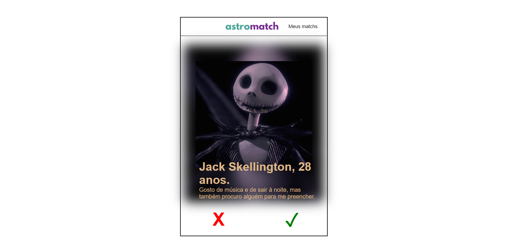
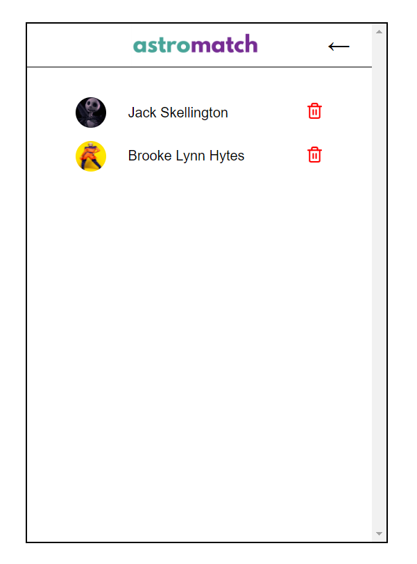

# Projeto React API Pokemons


Um clone do Tinder!

## Indice
- <a href="#Tecnológias-utilizadas"> Tecnológias utilizadas</a>
- <a href="#layout ">Layout </a>
- <a href="#demostração ">Demostração </a>
- <a href="#comorodaresseprojeto ">Como rodar esse projeto?</a>
- <a href="#tecnologiasutilizadas ">Tecnologias utilizadas</a>
- <a href="#pessoasautoras">Pessoas autoras</a>
- <a href="#proximospassos ">Proximos passos</a>

## 📱Fucionalidades do projeto

- **Página Home:**
	- [X]  Mostra o perfil de uma pessoa;
	- [X] Exibi um card que tem o nome, idade, um botão pra dar match, e um botão pra não dar match, no topo do card, tem um botão que leva para a pagina de pessoas que você deu o macth.
- **Página com lista das pessoas que o usuario deu match**
	- [X] Renderiza uma lista de pessoas que o usuario deu match;
	- [X] Tem a opção de remover a pessoas da lista de interesse;
	- [X] Tem um botão para voltar para a Home
	- [X] Não deve ser possível adicionar a mesma pessoa duas vezes;
    ## 👀Layout





## Demonstração

[Link demonstração](https://astromatchmatheusmendes.surge.sh/)

## Como rodar esse projeto?

```
# clone este repositorio
$ git clone https://github.com/MathMendesReis/AstroMath.git

# Acesse a pasta do projeto no seu terminal
$  cd clone-tinder/

#instale as depedências
$ npm install

# Execute a aplicação
$ npm run start

# A aplicação sera iniciada na porta 300, 
acesse pelo navegador: http:http://localhost:3000
```

## Tecnologias utilizadas

1. [React js](https://reactjs.org/)
2. [Styled-components](https://styled-components.com/)
3. [React Hooks](https://reactjs.org/docs/hooks-intro.html)
4. [Axios](https://axios-http.com/ptbr/docs/intro)

## Pessoas autoras


[Linkedin](https://www.linkedin.com/feed/?trk=seo-authwall-base_signin-form_submit)

## Proximos passos

-[ ] Torna o site responsivo
